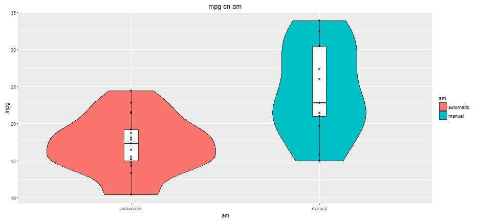
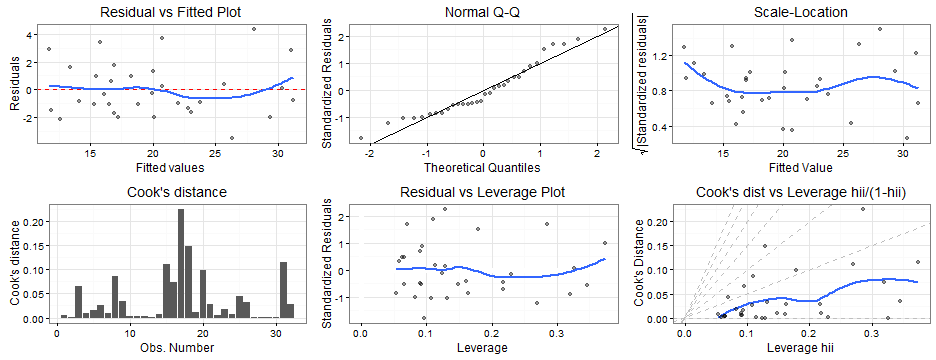

## Executive Summary
This presentation  analyses mtcars data from the 1974 Motor Trend US magazine 
and aims to create a linear regression model, predicting car fuel consumption:  

**Agenda**
* Is manual transmission better than automatic for fuel consumption?
* Selected predictive regression model: mpg ~ wt + qsec + am
* Model validaty with residuals plot

--- .class #id 
## Is manual better than automatic for mpg?

---

## Is manual better than automatic for mpg? (cont.)
* Regression model selected: mpg ~ qsec + wt + am
* The graphs shows that no firm conclusion can be taken
* For wt > 3.4 (1000 lbs) manual transmission seams to be worse
* However we only have one car above this level, i.e. the prediction model may 
not be accurate for manual cars with wt > 3.4

---

## Model validaty with residuals plot
* No relevant systematic patterns or large outlying observations  
* The data is approximately normally distributed
* No highly influential or high leverage and outlying points 

